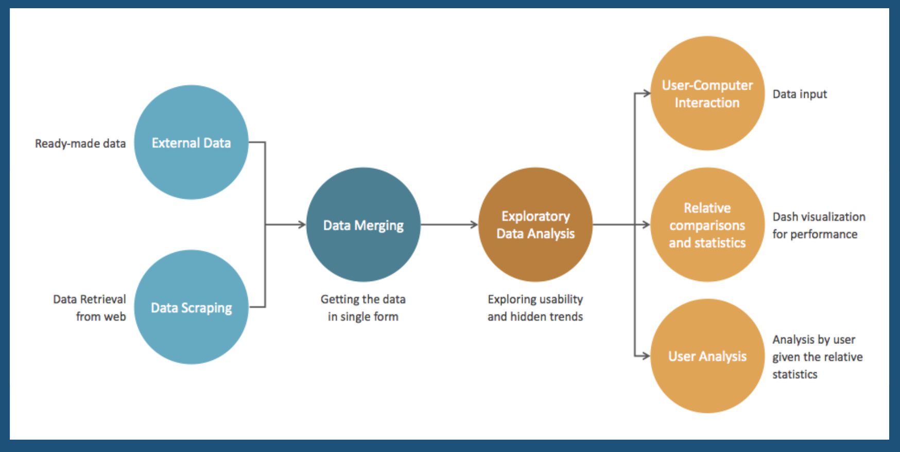

# Component Specifications

### Data Manager
The data manager forms the backbone of the tool. It involved sub-components working in unison to produce input needed for final product output. Here are the sub-components working for the data manager-
#### Data Scraping and Storage:
Web scraping is an online data acquisition method where selected info is programmatically downloaded from a website. 
Most marathon websites publically post details about their participants online, including split times. 
* Web scraping for the Chicago, London, and Berlin marathons yeilds more split time data and produces a more credible dashboard. Main Python packages used are mechanize for completing web forms and bs4 for parsing html. 
* The data scraping component manages corner cases such as missing data, inconsistent formatting, ascii vs unicode, etc.
#### Data Merger: 
Data inflow is from multiple distinct sources, the direct data buckets, and the web scraped data. 
* The data merging tool performs basic cleaning and drops runners with unintelligible or missing finish times were dropped.
* Since all large race datasets contain missing splits due to the imperfect nature of timing mats and chips, it does not drop runners with individual missing splits mid-race. 
* It takes care of data type conversion, for example, all time units were converted to a base unit of seconds. 
* Another important task it performs is that runners are binned based on age, using the parameters by which the Boston Athletic Association issues age group awards (these are common race age groups). 
* All years were merged based on key data: gender, age, age group, split times, finish time, rank, race year, etc. by the data merger

### Analytics Manager
The analytics manager is an assistant to the runner. It takes in inputs of time milestones from the user, and it establishes a comparison between user metrics and metrics from competitors in the previous years. It calculates the statistics like age and gender based progress relative to runners from the past year, their standing with respect to the running technique they follow and statistics informing them the specific regions they need to work on to achieve better standings for the marathon they are training for. It calculates user performance relative to the crowd average and the top 10 percentile of the demography. Along with that, this component takes care of basic Exploratory Analysis needed to establish metrics important to the user for improving themselves over time. Analytics Manager form the crux of the tool.

### Visualization Manager 
In a nutshell, the visualization manager takes input from the analytics manager and it displays metrics and relative numbers/statistics which would help the user measure themselves against competitors, therefore, helping them improve their training approach. Dash forms the backbone of the visualization manager. Here are some sub-components attached to it-
#### User Interaction:
This component works on the human-computer interaction part, where the user is allowed to enter basic information about themselves and their run. The user enters timing metrics for the given splits (5K time-40K time), along with basic details such as age and gender.
#### Analytics Visualization:
This component takes care of combining the results from the Analytics Manager with the Visualization Manager. The information entered by the user is analysed by the Analytics Manager and then displayed by the Visualization Manager. 
* The performance of user is bucketed based on age and gender, and displayed in the form of a graph relative to top 10 percentile competitors in the marathons of the given demography. We have demographic rankings, such as, gender and age balanced comparisons of athlete with previous year athletes. It displays information on consistency of pace and relative comparison with top 10 percentile and the average metrics of the demography
* The fatigue zone, is the area user needs to focus on. It displays their slowest zone, the region that slows them down
* The running strategy, defined by the split-ratio, the manager displays a graph, where the user can observe how they ran the first and the second halves, and the relative performance to average and top 10 percentile of previous year competitors.

### Project Plan

* Week 1 and Week 2: Collecting and scraping data from multiple sources. Merging the data sets.
* Week 2: Getting familiar with our data structure, setting up the final goal and performing EDA to understand our data better and explore possibilities. Scraping and Merging of data ongoing.
* Week 3: Create use case visualisations to understand how Dash works. Exploring other technological tools and possibilities. Scraping and Merging of data ongoing.
* Week 4: Work on creating a usable dashboard for multiple use cases and working on the code that goes behind the analytics of the data we have. Scraping and Merging of data ongoing.
* Week 5: Work on Dashboard, including important metrics, working on better user experience and better statistics reflecting the strategy, timing and distance for a run. Scraping and Merging of data ongoing.
* Week 6:Working on making final changes, aligning changes, unit testing, making our code scalable for the larger datasets and finishing our final product.
